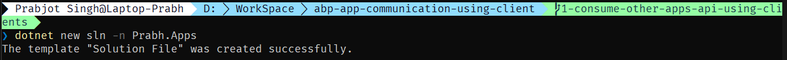
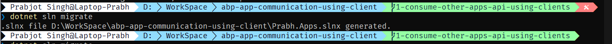
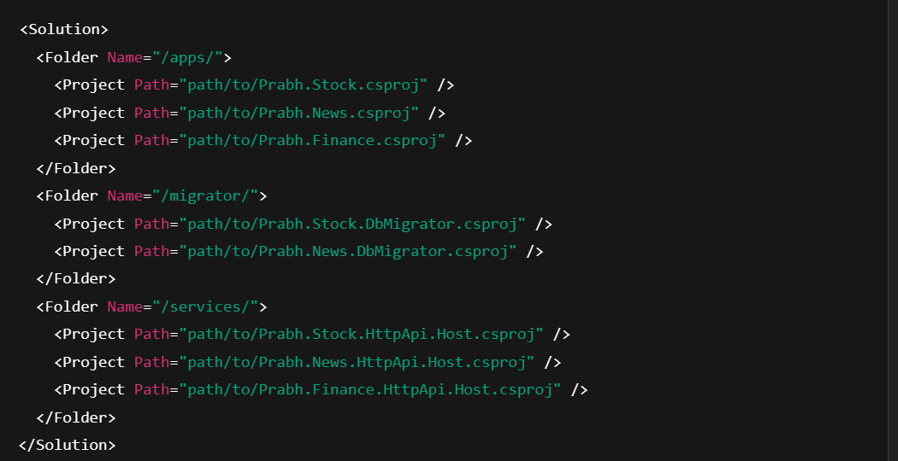
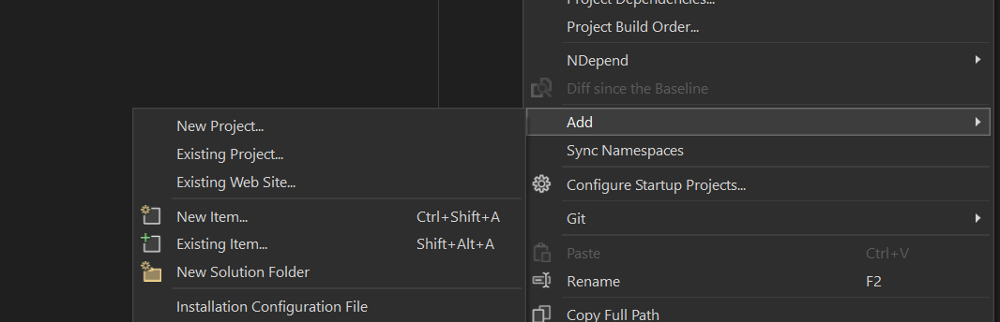
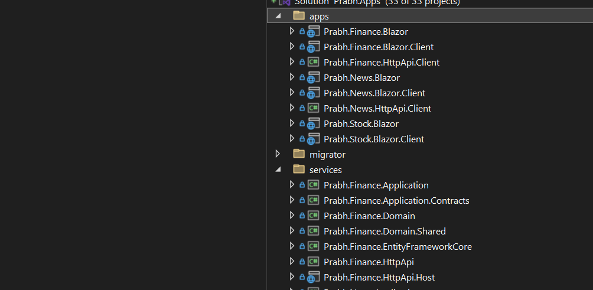
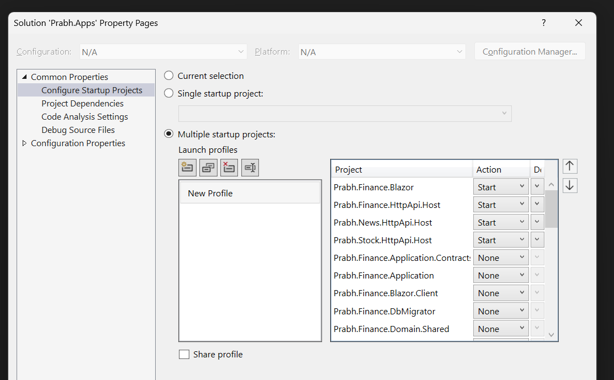

# 1- Understanding and adopting the new .slnx format to organize applications and services in a streamlined solution

## Introduction

This post is part of my <i>`Managing Communication and Restructring blazor UI in ABP Multi-App`</i>.
We are working with three primary applications:

- `Prabh.Stock` – Manages stock-related functionality
- `Prabh.News` – Handles market news and updates
- `Prabh.Finance` – Aggregates financial data, integrating both stock and news insights

In this article, we’ll simplify running one or more applications simultaneously by introducing a new .slnx solution file at the root level. We’ll add all related projects into it using Visual Studio and organize them into solution folders for better maintainability.

These applications use `Blazor` for the UI layer and `PostgreSQL` as the database provider.

### 💻 Source Code

Source code of the this completed post is [available on GitHub](https://github.com/008programmer/abp-multiple-apps-communication-and-restructuring/tree/1-consume-other-apps-api-using-clients).

### 🖼️ Screenshots

Here, the applications screenshot of all three applications.

**Prabh.Stock**

**Prabh.News**

**Prabh.Finance**

## Requirements

The following tools are needed to be able to run the solution.

- .NET 9.0 SDK
- Visual Studio 2022 or another compatible IDE
- PostgreSQL

Troubleshooting tip

- If you try to run more than one ABP application's UI at the same time through visual studio, you might encounter issues while running. A simple workaround is to open the second application in a different browser.

## ⚙️ Setup

### Open & Run the Application

- Open the Stock Application solution in Visual Studio (or your favorite IDE).
- Run the `Prabh.Stock.DbMigrator` application to seed the initial data.
- Run the `Prabh.Stock.HttpApi.Host` application that starts the server side.
- Run the `Prabh.Stock.Blazor` application to start the UI.
- Repeat above steps for <strong>Prabh.News</strong> and <strong>Prabh.Finance</strong>
- Stop All Applications after checking they are working fine.

## Development

### 🆕 Add a new Sln file by adding typing `dotnet new sln -n Prabh.Apps` in the root directory

- Add a empty solution name 'Prabh.Apps' in the root directory

  

- Ok Here is the Twist, dotnet has introduced a new compact & clean format slnx format. so lets migrate to it by typing `dotnet sln migrate`.
  

- Here is the format of new slnx
  

- Now open the visual studio using this new `Prabh.Apps.slnx`
- Then Right click and go to `Add` -> `New Solution Folder`

- Right click on solution folder and add existing project.

## 🔌 Run multiple apps

- Right click in solution and click `Multiple startup projects` and select these project

  - `Prabh.Stock.HttpApi.Host`
  - `Prabh.News.HttpApi.Host`
  - `Prabh.Finance.HttpApi.Host`
  - `Prabh.Finance.Blazor`

  - you will see `Prabh.Finance UI` and all `Finance, Stock, and News` backends are running

  

  

## Source Code

Source code of the this completed post is [available on GitHub](https://github.com/008programmer/abp-multiple-apps-communication-and-restructuring/tree/1-consume-other-apps-api-using-clients).

## Next

- While we are able to access `Stock API` and `News API` from `Finance UI`, But we found out that the process to run all four applications are quite complex.

- So, Our Next post is going to be 'Integrating `Prabh Finance UI` and APIs from Multiple ABP Applications into a new Solution' (Coming Soon\*)
