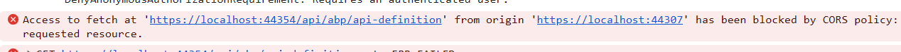
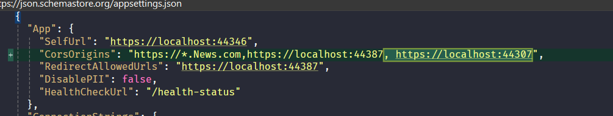

# 1- Accessing Multiple Remote ABP based Backends Using HttpApi.Client

## Introduction

This post is part of my <i>`Managing Communication and Restructring blazor UI in ABP Multi-App`</i>.
We are working with three primary applications:

- `Prabh.Stock` – Manages stock-related functionality
- `Prabh.News` – Handles market news and updates
- `Prabh.Finance` – Aggregates financial data, integrating both stock and news insights

In this article, we’ll demonstrate how to enable Prabh.Finance to call the backends of Prabh.News and Prabh.Stock by adding their HttpApi.Client projects as references.

These applications use `Blazor` for the UI layer and `PostgreSQL` as the database provider.

### 💻 Source Code

Source code of the this completed post is [available on GitHub](https://github.com/008programmer/abp-multiple-apps-communication-and-restructuring/tree/2-manage-complexity-by-new-slnx).
ddd

### 🖼️ Screenshots

Here, the applications screenshot of all three applications.

**Prabh.Stock**


**Prabh.News**


**Prabh.Finance**


## Requirements

The following tools are needed to be able to run the solution.

- .NET 9.0 SDK
- Visual Studio 2022 or another compatible IDE
- PostgreSQL

Troubleshooting tip

- If you try to run more than one ABP application's UI at the same time through visual studio, you might encounter issues while running. A simple workaround is to open the second application in a different browser.

## Setup

### Open & Run the Application

- Open the Stock Application solution in Visual Studio (or your favorite IDE).
- Run the `Prabh.Stock.DbMigrator` application to seed the initial data.
- Run the `Prabh.Stock.HttpApi.Host` application that starts the server side.
- Run the `Prabh.Stock.Blazor` application to start the UI.
- Repeat above steps for <strong>Prabh.News</strong> and <strong>Prabh.Finance</strong>
- Stop All Applications after checking they are working fine.

## Development

### 🆕 `Prabh Stock Application` Changes

- Update Remote Service Name for Stock API

  - Open the `Prabh.Stock.HttpApi.Client` project and update the name of the Stock application's backend remote service to `Stock`.
    ```csharp
    public const string RemoteServiceName = "Default";
    //change to
    public const string RemoteServiceName = "Stock";
    ```

- Decouple and Add new value in Remote Service for Stock API

  - Add a new `Stock` property with the same URL as `Default` in `appsettings`.

    This change is part of our effort to decouple our APIs from the pre-existing backend APIs (such as `Accounts`, `tenant`,`localization`, etc.).

    ### Going forward:

  - The **Stock UI** and any third party(`e.g. Prabh Finance UI`) will use the `Stock` prop URL to communicate with APIs developed by us.
  - The **Stock UI** will use the `Default` prop URL to communicate with APIs developed by abp and attached to our backend.

    ```json
    "RemoteServices": {
      "Default": {
        "BaseUrl": "https://localhost:44354"
      },
      "AbpAccountPublic": {
        "BaseUrl": "https://localhost:44354"
      }
    }
    //add a new prop named Stock
    "RemoteServices": {
      "Default": {
        "BaseUrl": "https://localhost:44354"
      },
      "Stock": {
        "BaseUrl": "https://localhost:44354"
      },
      "AbpAccountPublic": {
        "BaseUrl": "https://localhost:44354"
      }
    },
    ```

    similar type of changes is needed for `News API`

### 🆕 `Prabh Finance Application` Changes

- Open the **Prabh Finance Application** solution in Visual Studio (or your preferred IDE).
- In the `Prabh.Finance.HttpApi.Client` project, add project references to:

  - `Prabh.Stock.HttpApi.Client`
  - `Prabh.News.HttpApi.Client`
    ```
      <ProjectReference Include="..\..\..\Prabh.Stock\src\Prabh.Stock.HttpApi.Client\Prabh.Stock.HttpApi.Client.csproj" />
      <ProjectReference Include="..\..\..\Prabh.News\src\Prabh.News.HttpApi.Client\Prabh.News.HttpApi.Client.csproj" />
    ```

- Sometimes Visual Studio does show a error related to reference. If you encounter this issue, run the following command in the terminal to resolve it and restart visual studio

  ```cmd
  dotnet restore or dotnet build /graphbuild
  ```

- Open `FinanceHttpApiClientModule` module and add `StockHttpApiClientModule` in the DependsOn(a beauty of ABP modularity)

  ```csharp
  using Prabh.Stock;
  using Prabh.News;

  namespace Prabh.Finance;

  [DependsOn(
      // Code remove for brevity
      typeof(StockHttpApiClientModule)
  )]
  public class FinanceHttpApiClientModule : AbpModule
  {
      // Code remove for brevity
  }
  ```

- You can now access the **Stock APIs** from within the **Finance UI**
- Similar changes are required to integrate the **News API**

### 🔗 `Prabh Finance Blazor` Consume APIs from Stock and News to combine the Data.

- Open `Index.Razor.cs` inside Pages of `Prabh.Finance.Blazor.Client` and change to something like this.

  ```csharp
    using Blazorise;
    using Microsoft.AspNetCore.Components;
    using Prabh.News.Books;
    using Prabh.Stock.Books;
    using System;
    using System.Collections.Generic;
    using System.Linq;
    using System.Threading.Tasks;
    using Volo.Abp.AspNetCore.Components.Alerts;

    namespace Prabh.Finance.Blazor.Client.Pages;


    public record LatestStockNews(string Ticker, string CompanyName, decimal CurrentPrice, string Summary);


    public partial class Index
    {

        [Inject] public IStockAppService StockAppService_HTTP { get; set; }

        [Inject] public INewsAppService NewsAppService_HTTP { get; set; }

        [Inject]  IMessageService MessageService { get; set; }


        private List<LatestStockNews> LatestStockNews = [];
        protected override async Task OnInitializedAsync()
        {
            await base.OnInitializedAsync();

            try
            {
                var stockResponse = await StockAppService_HTTP.GetThisMonthTopStocksAsync();
                var newsResponse = await NewsAppService_HTTP.GetTopMonthlyNewsAsync();

                LatestStockNews = [.. from s in stockResponse.Items.ToList()
                                              join n in newsResponse.Items.ToList() on s.Ticker equals n.Ticker
                                              select new LatestStockNews(s.Ticker, s.CompanyName, s.CurrentPrice, n.Summary)];
            }
            catch (System.Exception ex)
            {
                //This is just to mange eror If any external apis are not working or not reachable.
                MessageService?.Error("Error calling Stock Or New APis. See Console for me error");
                Console.WriteLine(ex.Message ?? ex.InnerException.Message);
            }
        }
    }

  ```

- Open `Index.Razor.cs` inside Pages of `Prabh.Finance.Blazor.Client` and change to something like this.

  ```html
  <div class="card-body f">
    <div class="starting-content pe-5" style="position:static !important">
      <h1 class="f3">Prabh <strong class="c">Finance</strong> Website</h1>
      <p>💕💕 Utlimate Solution for Finance Management</p>

      <div>
        @if (LatestStockNews.Count > 0) {
        <CardDeck>
          @foreach (var item in LatestStockNews) {
          <Card Background="Background.Success" WhiteText>
            <CardBody>
              <CardTitle Size="5">
                <div class="d-flex justify-content-between">
                  <div>@item.CompanyName</div>
                  <div>$ @item.CurrentPrice</div>
                </div>
              </CardTitle>

              <CardText> @item.Summary </CardText>
            </CardBody>
          </Card>
          }
        </CardDeck>
        } else {
        <Callout Color="CalloutColor.Danger" HideHeading="true">
          <h4>Something is Wrong</h4>
          <p>
            No stock news could be loaded. Please check with your admin or try
            again later.
          </p>
        </Callout>
        }
      </div>
    </div>
  </div>
  ```

## ⚠️ Wait! `CORS` Still Needs to Be Configured

- One final change is needed in the `Stock API` and `News API`: currently, these services only accept HTTP requests from specific UI/Domain.

  

  Please update the appsettings.json of both projects to allow requests from Prabh Finance UI, then restart the applications.

  - `Prabh.Stock.HttpApi.Host`
  - `Prabh.News.HttpApi.Host`

  

- Change the `Pages/Index.razor` content in the `EventOrganizer.Blazor` project as shown below:

Run the `EventOrganizer.HttpApi.Host` application to see the new `upcoming` endpoint on the Swagger UI:

## 🔌 Run & Results

- Run these project
  - `Prabh.Stock.HttpApi.Host`
  - `Prabh.News.HttpApi.Host`
  - `Prabh.Finance.HttpApi.Host`
  - `Prabh.Finance.Blazor`


## Source Code

Source code of the this completed post is [available on GitHub](https://github.com/008programmer/abp-multiple-apps-communication-and-restructuring/tree/1-consume-other-apps-api-using-clients).

## Next

- While we are able to access `Stock API` and `News API` from `Finance UI`, But we found out that the process to run all four applications are quite complex and separated.

- So, Our Next post is going to be 'Adopting the new .slnx format to organize applications and services in a streamlined solution' and is
  [available on GitHub](https://github.com/008programmer/abp-multiple-apps-communication-and-restructuring/tree/2-manage-complexity-by-new-slnx)
