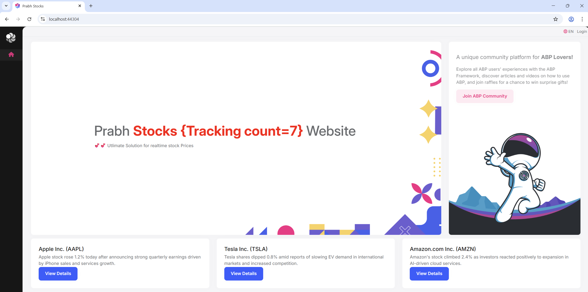
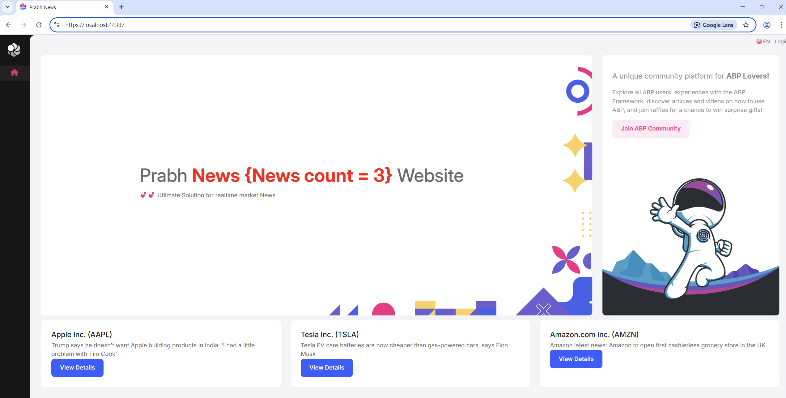
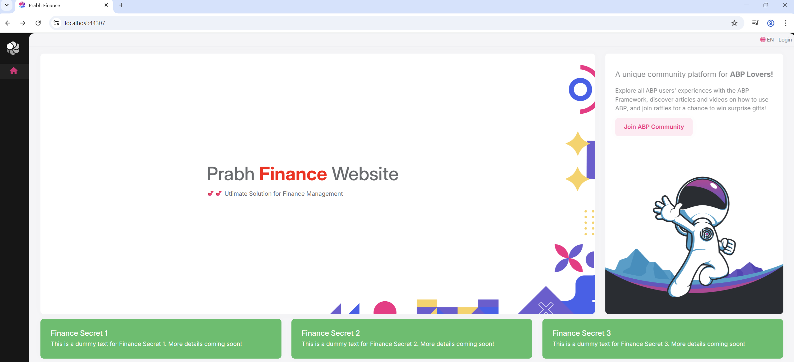

# Commmunicating to separate abp based applications backend using their HttpApi.Client

## Introduction

In this article, we will manage to call Prabh.News and Prabh.Stocks backends using their HttpApi.Clients

The application has been developed with **Blazor** as the UI framework and **backend** as the database provider.

> This tutorial is a small portion of a big playlis name 'Managing and restucting blazor UI through RCL of multiple abp towards microservice approach

### Source Code

Source code of the completed application is [available on GitHub](https://github.com/abpframework/abp-samples/tree/master/EventOrganizer).

### Screenshots

Here, the applications screenshot of all three applications.

**Home Page - Base Application Prabh.Stock**



**Home Page - Base Application Prabh.News**



**Home Page - News Application Prabh.Finance**



## Requirements

The following tools are needed to be able to run the solution.

- .NET 9.0 SDK
- Visual Studio 2022 or another compatible IDE
- PostgreSQL

## Development

### Notest about Running all Applications side by side

- If you try to run more the one application UI at a time that Sometimes it creates problem so you can choose different browser to run the second application UI.

### Open & Run the Application

- Open the Stock Application solution in Visual Studio (or your favorite IDE).
- Run the `Prabh.Stock.DbMigrator` application to seed the initial data.
- Run the `Prabh.Stock.HttpApi.Host` application that starts the server side.
- Run the `Prabh.Stock.Blazor` application to start the UI.
- Repeat above steps for <strong>Prabh.News</strong> and <strong>Prabh.Finance</strong>
- Stop All Applications after checking they are working fine.

### `Stock API` Configuration Update

- Update Remote Service Name for Stock API

  - Open the `Prabh.Stock.HttpApi.Client` project and update the name of the Stock application's backend remote service to `Stock`.
    ```csharp
    public const string RemoteServiceName = "Default";
    //change to
    public const string RemoteServiceName = "Stock";
    ```

- Decouple and Add new value in Remote Service for Stock API

  - Add a new `Stock` property with the same URL in `appsettings`.

    This change is part of our effort to decouple our APIs from the inherited backend APIs (such as `Accounts`, `Permissions`, etc.).

    ### Going forward:

  - The **Stock UI** and any third party(`e.g. Prabh Finance`) will use the `Stock` prop URL to communicate with APIs developed by us.
  - The **Stock UI** will use the `Default` prop URL to communicate with APIs developed by abp and atached to our backend.

    ```json
    "RemoteServices": {
      "Default": {
        "BaseUrl": "https://localhost:44354"
      },
      "AbpAccountPublic": {
        "BaseUrl": "https://localhost:44354"
      }
    }
    //add a new prop named Stock
    "RemoteServices": {
      "Default": {
        "BaseUrl": "https://localhost:44354"
      },
      "Stock": {
        "BaseUrl": "https://localhost:44354"
      },
      "AbpAccountPublic": {
        "BaseUrl": "https://localhost:44354"
      }
    },
    ```

### `Prabh Finance` UI Configuration Update

- Open the **Prabh Finance Application** solution in Visual Studio (or your preferred IDE).
- In the `Prabh.Finance.HttpApi.Client` project, add project references to:

  - `Prabh.Stock.HttpApi.Client`
  - `Prabh.News.HttpApi.Client`

      <ProjectReference Include="..\..\..\Prabh.Stock\src\Prabh.Stock.HttpApi.Client\Prabh.Stock.HttpApi.Client.csproj" />
      <ProjectReference Include="..\..\..\Prabh.News\src\Prabh.News.HttpApi.Client\Prabh.News.HttpApi.Client.csproj" />

  ```

  ```

- Sometimes Visual Studio does show a error related to reference. If you encounter this issue, run the following command in the terminal to resolve it and restart visual studio

  ```cmd
  dotnet restore
  ```

- Open `FinanceHttpApiClientModule` module and add `StockHttpApiClientModule` in the DependsOn(a beauty of ABP modularity)

  ```csharp
  using Prabh.Stock;
  using Prabh.News;

  namespace Prabh.Finance;

  [DependsOn(
      // Code remove for brevity
      typeof(StockHttpApiClientModule)
  )]
  public class FinanceHttpApiClientModule : AbpModule
  {
      // Code remove for brevity
  }
  ```

- You can now access the **Stock APIs** from within the **Finance UI**
- Similar changes are required to integrate the **News API**

The Result (run the `EventOrganizer.Blazor` application to see):

### `Prabh Finance` Consume APIs from Stock and News to combine the Data.

- Open `Index.Razor.cs` inside Pages of `Prabh.Finance.Blazor.Client` and change to something like this.

  ```csharp
    using Blazorise;
    using Microsoft.AspNetCore.Components;
    using Prabh.News.Books;
    using Prabh.Stock.Books;
    using System;
    using System.Collections.Generic;
    using System.Linq;
    using System.Threading.Tasks;
    using Volo.Abp.AspNetCore.Components.Alerts;

    namespace Prabh.Finance.Blazor.Client.Pages;


    public record LatestStockNews(string Ticker, string CompanyName, decimal CurrentPrice, string Summary);


    public partial class Index
    {

        [Inject] public IStockAppService StockAppService_HTTP { get; set; }

        [Inject] public INewsAppService NewsAppService_HTTP { get; set; }

        [Inject]  IMessageService MessageService { get; set; }


        private List<LatestStockNews> LatestStockNews = [];
        protected override async Task OnInitializedAsync()
        {
            await base.OnInitializedAsync();

            try
            {
                var stockResponse = await StockAppService_HTTP.GetThisMonthTopStocksAsync();
                var newsResponse = await NewsAppService_HTTP.GetTopMonthlyNewsAsync();

                LatestStockNews = [.. from s in stockResponse.Items.ToList()
                                              join n in newsResponse.Items.ToList() on s.Ticker equals n.Ticker
                                              select new LatestStockNews(s.Ticker, s.CompanyName, s.CurrentPrice, n.Summary)];
            }
            catch (System.Exception ex)
            {
                //This is just to mange eror If any external apis are not working or not reachable.
                MessageService?.Error("Error calling Stock Or New APis. See Console for me error");
                Console.WriteLine(ex.Message ?? ex.InnerException.Message);
            }
        }
    }

  ```

- Open `Index.Razor.cs` inside Pages of `Prabh.Finance.Blazor.Client` and change to something like this.
  ```html
  @page "/" @inherits EventOrganizerComponentBase
  ```

#### Still getting error Maybe this one


- There is one thing left to change in Stock API and News API we are only accepting http request from certain UI. Do something like this accept HTTP request from `Prabh Finance UI` in appsettings of below projects and restart them

  - `Prabh.Stock.HttpApi.Host`
  - `Prabh.News.HttpApi.Host`

  


The Result (run the `EventOrganizer.Blazor` application to see):

- Change the `Pages/Index.razor` content in the `EventOrganizer.Blazor` project as shown below:

Run the `EventOrganizer.HttpApi.Host` application to see the new `upcoming` endpoint on the Swagger UI:

The new home page is shown below:


Run the `EventOrganizer.HttpApi.Host` application to see the complete Event HTTP API in the Swagger UI:


- Create `EventDetail.razor` component with the following content:

```html

```

- Create `EventDetail.razor.cs` file with the following content:

```csharp

```

The resulting page is shown below:


### Integration Tests

Create an `EventAppService_Tests` class in the `EventOrganizer.Application.Tests` project:

```csharp

```

## Source Code

Source code of the this completed post is [available on GitHub](https://github.com/008programmer/abp-multiple-apps-communication-and-restructuring/tree/1-consume-other-apps-api-using-clients).

## Others Errors

- Refernce and Abp Clean
- Cors

- Why Usage fo Graphbuild
