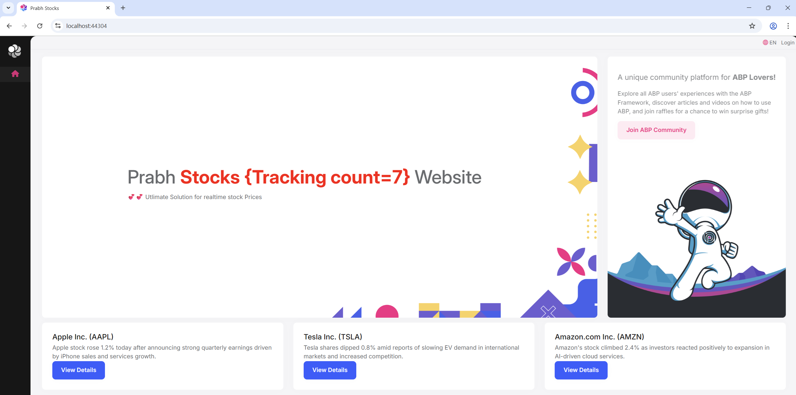
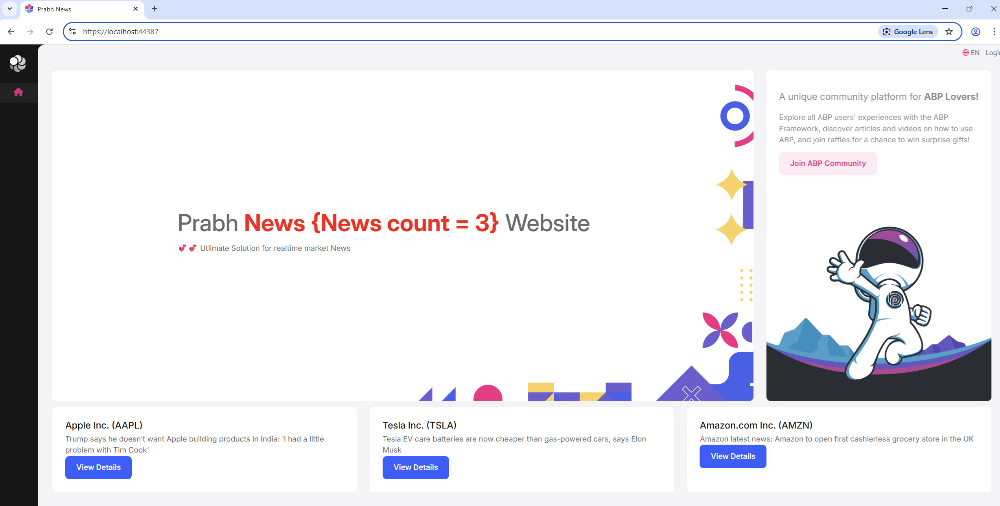
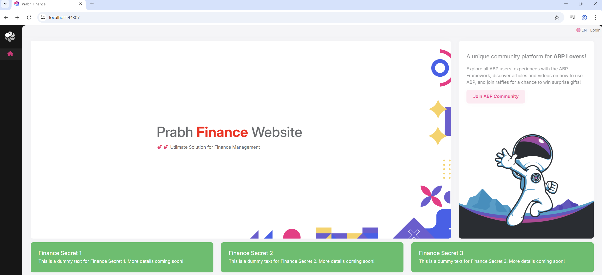
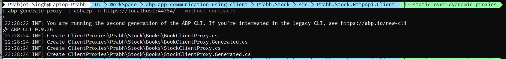
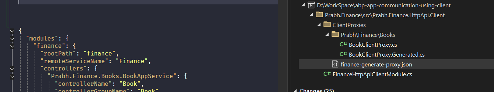
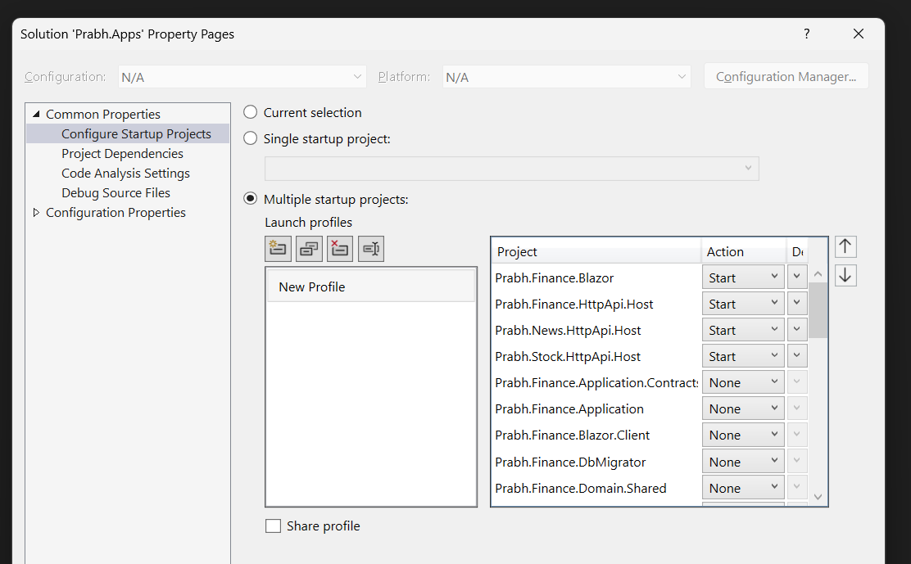
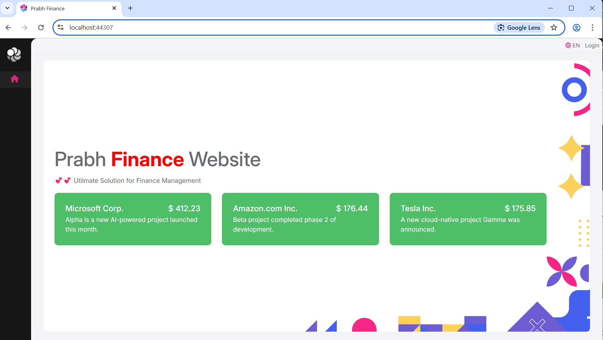

# 3- Replacing dynamic proxies with static proxies

## Introduction

This post is part of my <i>`Managing Communication and Restructring blazor UI in ABP Multi-App`</i> series.
We are working with three primary applications:

- `Prabh.Stock` – Manages stock-related functionality
- `Prabh.News` – Handles market news and updates
- `Prabh.Finance` – Aggregates financial data, integrating both stock and news insights

In this article, we’ll switch from dynamic to static client proxies in ABP and explore the key benefits of using static proxies, such as improved performance, stronger typing, and better maintainability.

These applications use `Blazor` for the UI layer and `PostgreSQL` as the database provider.

### 🖼️ Screenshots

Here, the applications screenshot of all three applications.

**Prabh.Stock**



**Prabh.News**



**Prabh.Finance**



## Requirements

The following tools are needed to be able to run the solution.

- .NET 9.0 SDK
- Visual Studio 2022 or another compatible IDE
- PostgreSQL

Troubleshooting tip

- If you try to run more than one ABP application's UI at the same time through visual studio, you might encounter issues while running. A simple workaround is to open the second application in a different browser.

## ⚙️ Setup

### Open & Run the Application

- Open the Stock Application solution in Visual Studio (or your favorite IDE).
- Run the `Prabh.Stock.DbMigrator` application to seed the initial data.
- Run the `Prabh.Stock.HttpApi.Host` application that starts the server side.
- Run the `Prabh.Stock.Blazor` application to start the UI.
- Repeat above steps for <strong>Prabh.News</strong> and <strong>Prabh.Finance</strong>
- Stop All Applications after checking they are working fine.

## Development

### 📖 ABP Client Proxy Types

- ABP provides two types of API client proxies:

  #### Static Proxies

  - Generated at development time

  - Faster performance (no runtime metadata fetching)

  - Must be manually regenerated when API changes

  - Ideal for production scenarios

  #### Dynamic Proxies

  - Generated at runtime

  - No need to regenerate when API changes

  - Easier to use during early development and testing

  - Slightly slower at runtime

  For more details, check out the official [ABP documentation](https://abp.io/docs/latest/framework/api-development/static-csharp-clients)

### 🆕 Switching from Dynamic to Static Proxies in ABP

1. The backend API must be running when generating the static proxies.
   so Let's first generate proxy for `Prabh.Stock.HttpApi.Host`

2. Go to the root folder of the .Client project whose static proxies we want to generate, in our case it is `Prabh.Stock.HttpApi.Client`

   

3. Repeat steps 1 and 2 these for `News and Finance API`

4. Go to `Prabh.Stock.HttpApi.Client` and replace AddHttpClientProxies with AddHttpClientProxies and repeat for `Prabh.Finance.HttpApi.Client` and `Prabh.News.HttpApi.Client`

   ```csharp
   public class StockHttpApiClientModule : AbpModule
   {
       public const string RemoteServiceName = "Stocks";

       public override void ConfigureServices(ServiceConfigurationContext context)
       {
           context
             .Services
             //.AddHttpClientProxies(
             .AddStaticHttpClientProxies(
               typeof(StockApplicationContractsModule).Assembly,
               RemoteServiceName
           );
       }
   }
   ```

## ⚠️ Small Fixes for Modular Setup

- Typically when a proxy file is generated for a default setup it named is `abp-generate-proxy.json`, but becuase we are going modular, some fixes needs to done.
  - Rename `abp-generate-proxy.json` to `{RemoteServiceName}-generate-proxy.json`
  - Also change rootPath and remoteServiceName to {RemoteServiceName} like the image below
    

## 🔌 Run multiple apps

- To run everything together:

1.  Right-click on the solution > Set Startup Projects
2.  Choose Multiple startup projects
3.  Select:

    - `Prabh.Stock.HttpApi.Host`
    - `Prabh.News.HttpApi.Host`
    - `Prabh.Finance.HttpApi.Host`
    - `Prabh.Finance.Blazor`

4.  Once started, you’ll have running instances of : `Prabh.Finance UI` and all `Finance, Stock, and News` backends that are using static proxies for communication





## Source Code

Source code of the this completed post is [available on GitHub](https://github.com/008programmer/abp-multiple-apps-communication-and-restructuring/tree/2-manage-complexity-by-new-slnx).

## Next

Now that we've integrated the `Finance UI` with all APIs using static proxies, the next step is to replace project references with NuGet package references — and explore the architectural and maintainability advantages this approach offers.
