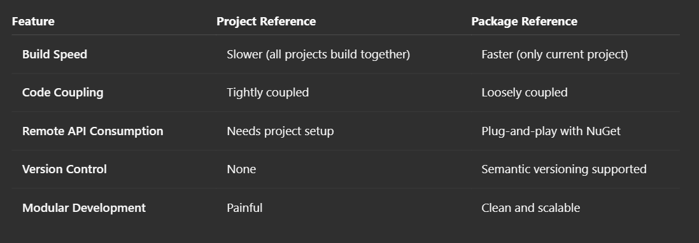
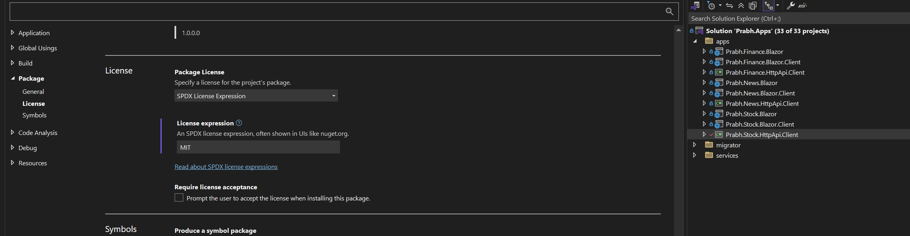
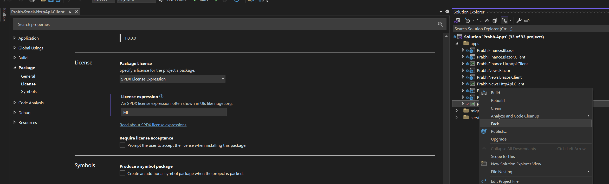
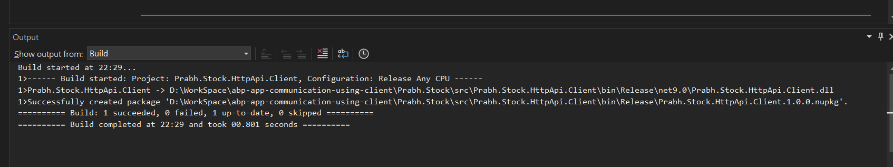
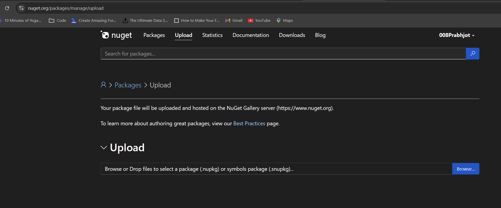
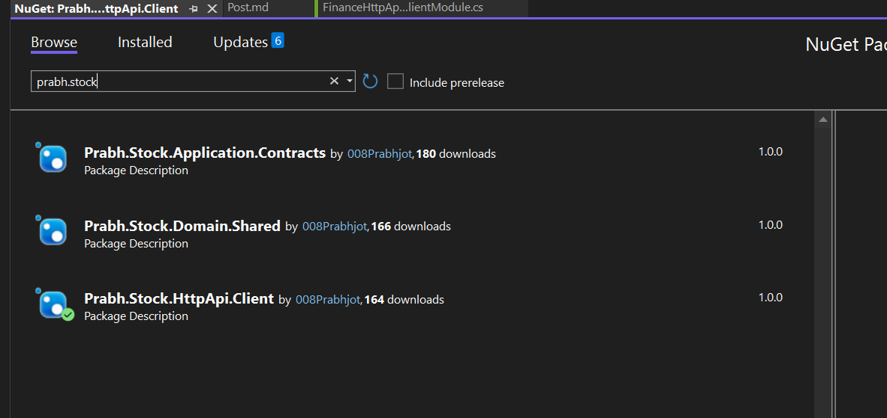
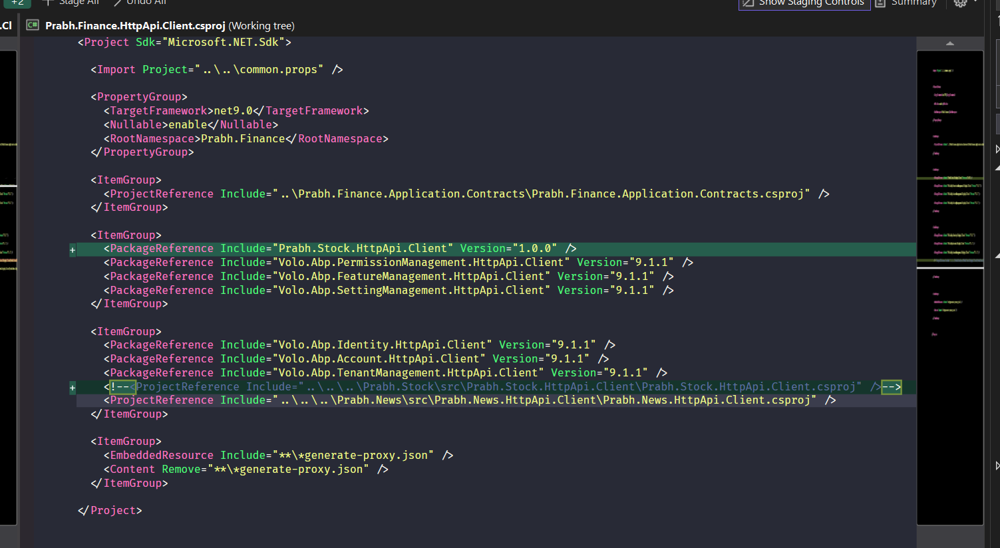

# 4 - Switching from Project References to Package References

## Introduction

This post is part of my <i>`Managing Communication and Restructring blazor UI in ABP Multi-App`</i> series.
We are working with three primary applications:

- `Prabh.Stock` – Manages stock-related functionality
- `Prabh.News` – Handles market news and updates
- `Prabh.Finance` – Aggregates financial data, integrating both stock and news insights

In this article, we’ll switch from Project References to Package References in ABP and explore the key benefits of using package reference, such as loose coupling between services, and faster builds.

Once your solution involves multiple apps or user interfaces, relying solely on project references can quickly become a bottleneck.

This aligns perfectly with ABP’s recommendation to use static client proxies with packaged
HttpApi.Client projects.

These applications use `Blazor` for the UI layer and `PostgreSQL` as the database provider.

### 🖼️ Screenshots

Here, the applications screenshot of all three applications.

**Prabh.Stock**

**Prabh.News**

**Prabh.Finance**

## Requirements

The following tools are needed to be able to run the solution.

- .NET 9.0 SDK
- Visual Studio 2022 or another compatible IDE
- PostgreSQL

Troubleshooting tip

- If you try to run more than one ABP application's UI at the same time through visual studio, you might encounter issues while running. A simple workaround is to open the second application in a different browser.

## ⚙️ Setup

### Open & Run the Application

- Open the Stock Application solution in Visual Studio (or your favorite IDE).
- Run the `Prabh.Stock.DbMigrator` application to seed the initial data.
- Run the `Prabh.Stock.HttpApi.Host` application that starts the server side.
- Run the `Prabh.Stock.Blazor` application to start the UI.
- Repeat above steps for <strong>Prabh.News</strong> and <strong>Prabh.Finance</strong>
- Stop All Applications after checking they are working fine.

## Development

### 📖 What Are Project References?

- Project references are a direct link between two projects in the same solution or outside. For example, `Prabh.Finance.Blazor.Client` UI project may have a reference to `Prabh.Finance.HttpApi.Client`.

  This is fine when:

  - All projects are in the same solution.

  - You are in the early stages of development.

  - You want immediate access to code changes without publishing.

  But it comes with a cost:

  - Solutions become tightly coupled.

  - Builds become slower and more error-prone.

  - Code sharing across solutions or repositories is difficult.

  - Managing versioning is impossible.

### 📦 Enter Package References

- Package references are a cleaner alternative — you build your shared projects once, publish them as NuGet packages, and consume them via versioned references.

  In the context of ABP and our apps:

  - We generated static client proxies for APIs (instead of using dynamic ones).
  - We will package them as NuGet packages.
  - Reference these packages in your consumer UIs or apps.

  This approach brings:

  - Loose coupling between services.
  - Faster builds, since projects don’t compile together.
  - Clear version control and upgrade paths.
  - Better developer experience when dealing with remote backends or micro-frontends.

  Comparision between Package v/s Project References

  

  [Creating and publishing NuGet packages](https://learn.microsoft.com/en-gb/nuget/quickstart/create-and-publish-a-package-using-the-dotnet-cli) is a broad topic with its own set of [best practices](https://learn.microsoft.com/en-gb/nuget/create-packages/package-authoring-best-practices), so I’ve chosen not to cover it in this video. If you’re interested, you can explore the following resources

### 🆕 Create the package using Visual Studio

1. Let's first generate package for `Prabh.Stock.HttpApi.Host`

2. Go to the root folder of the .Client project and choose project and properties
   

   - Enter Essentials package details, choose a md file for readme and Choose Licencse type 'SDPX Licence Expression' and in Licence Expression textbox below type 'MIT'

3. Once done, choose release mode and then right-click on the project and select ‘Pack’ after building it again.
   
4. If successful, you'll see the output in the Output window.
   

5. Create an account on the official NuGet website if you haven't registered already.
    and upload your nupkg file that will be in your bin / release folder

### ⚠️ Caution: It's always better to use static proxies along with contracts when moving towards NuGet packages

- You can learn more about it at [abp docs](https://abp.io/docs/latest/framework/api-development/static-csharp-clients#with-contracts-or-without-contracts)

- If we had created the static proxies with contracts in our previous blog, we wouldn't need to create three separate packages now.
  
- There's no need to install all three packages separately. Simply installing the parent package is enough, as it will automatically bring in its dependent packages.
- Our csproj file will look somethink like this
  

## 🔌 Run multiple apps

- To run everything together:

1.  Right-click on the solution > Set Startup Projects
2.  Choose Multiple startup projects
3.  Select:

    - `Prabh.Stock.HttpApi.Host`
    - `Prabh.News.HttpApi.Host`
    - `Prabh.Finance.HttpApi.Host`
    - `Prabh.Finance.Blazor`

4.  Once started, you’ll have running instances of : `Prabh.Finance UI` and all `Finance, Stock, and News` backends that are using package refernces for communication
    

## Source Code

Source code of the this completed post is [available on GitHub](https://github.com/008programmer/abp-multiple-apps-communication-and-restructuring/tree/4-switching-from-project-references-to-package).

## Next

Now that we have replaced our project references with package references, the next step is to replace News and Stocks Blazor application into one backOffice UI app along with Finance UI public app while exploring ABP.
